# TodoApp
Final Android project of college
# About the App
The todo-app is an app where a user can add their daily task or list of thing to be done. The user needs to first register in order to signin. The user can add, edit and delete their todo list. The app has two different type of todo which are with orm and without the orm.
# Screenshots of TodoApp
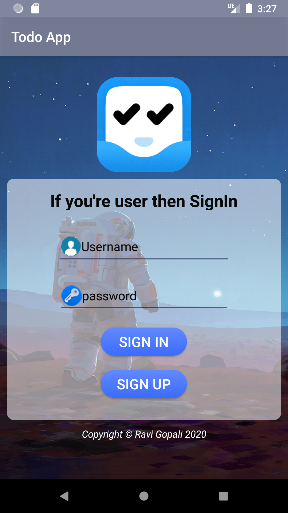
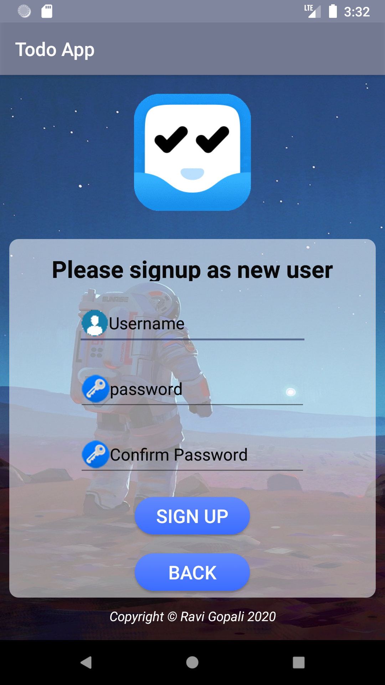

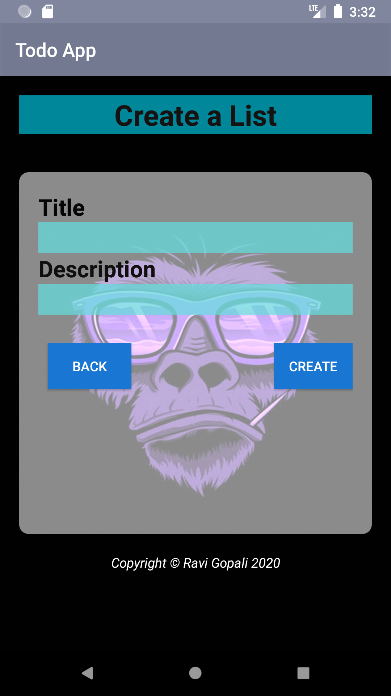
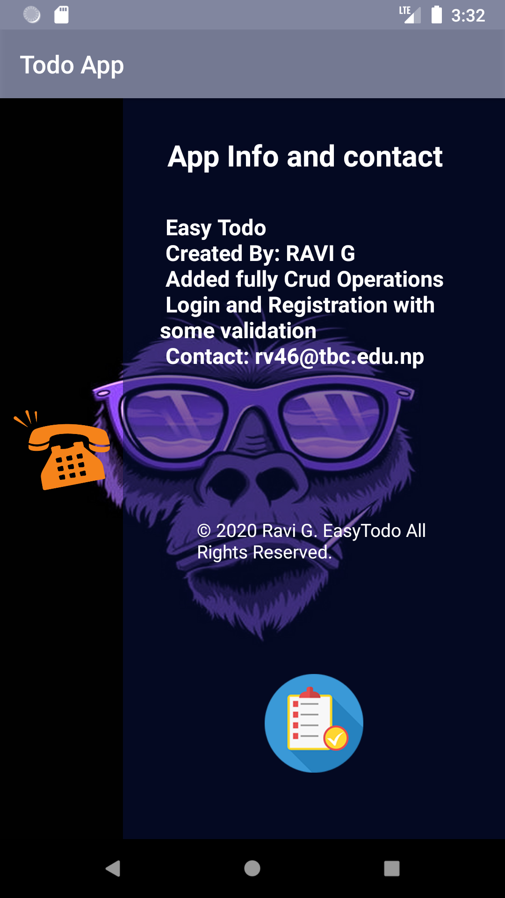
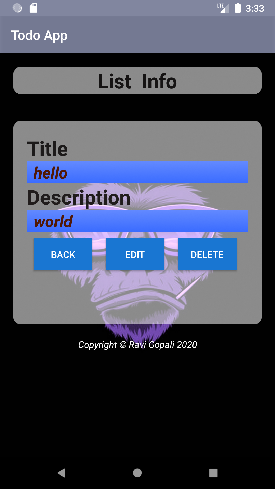
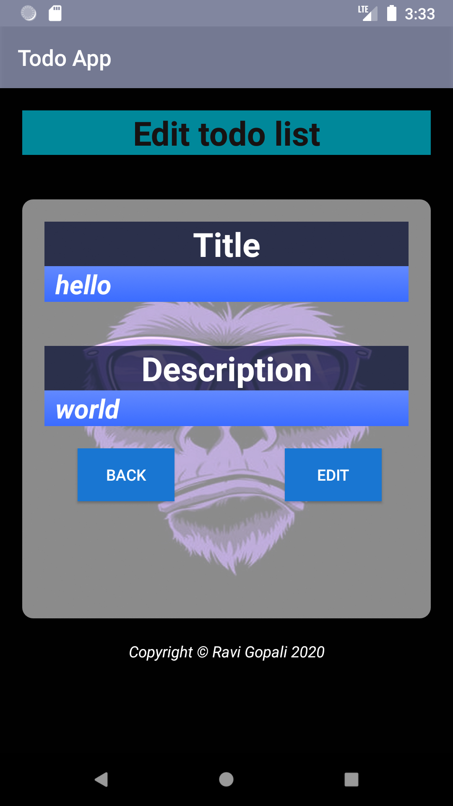
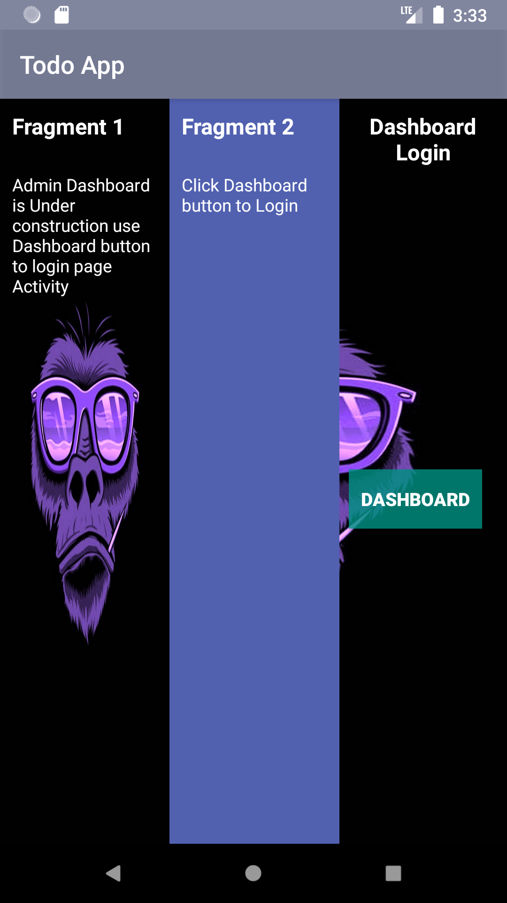
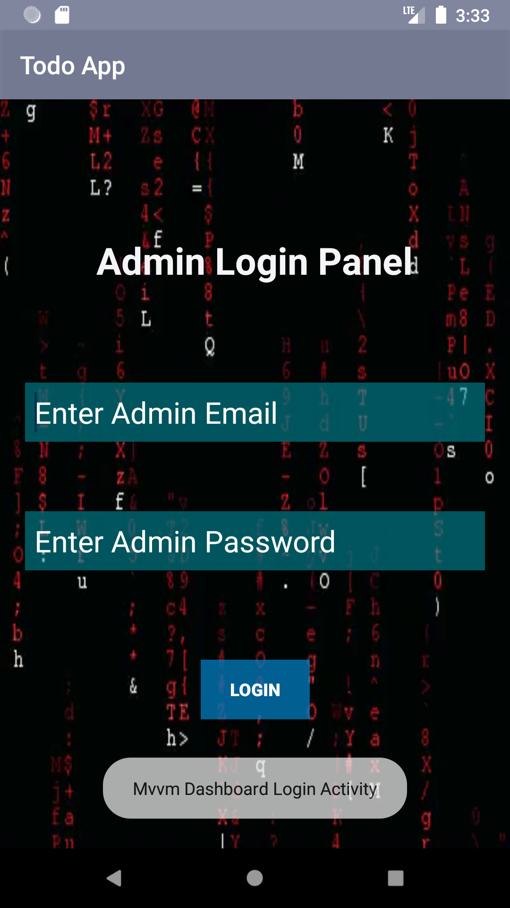
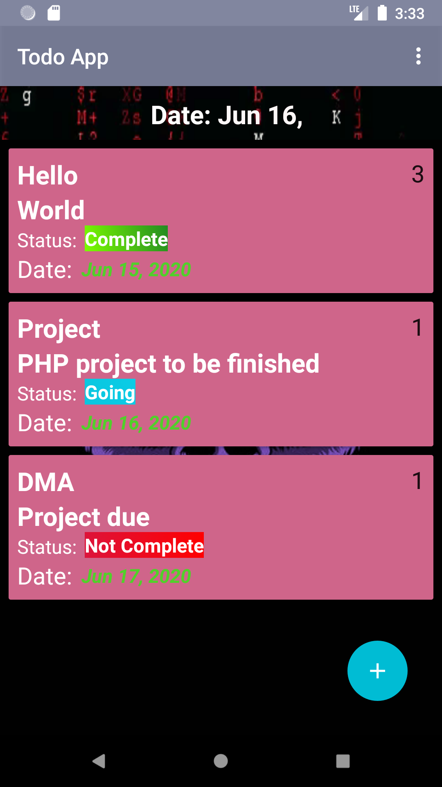
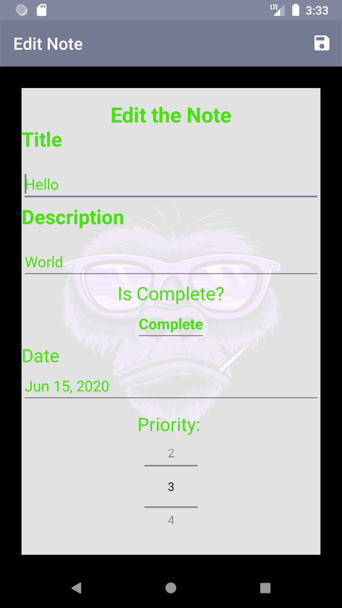
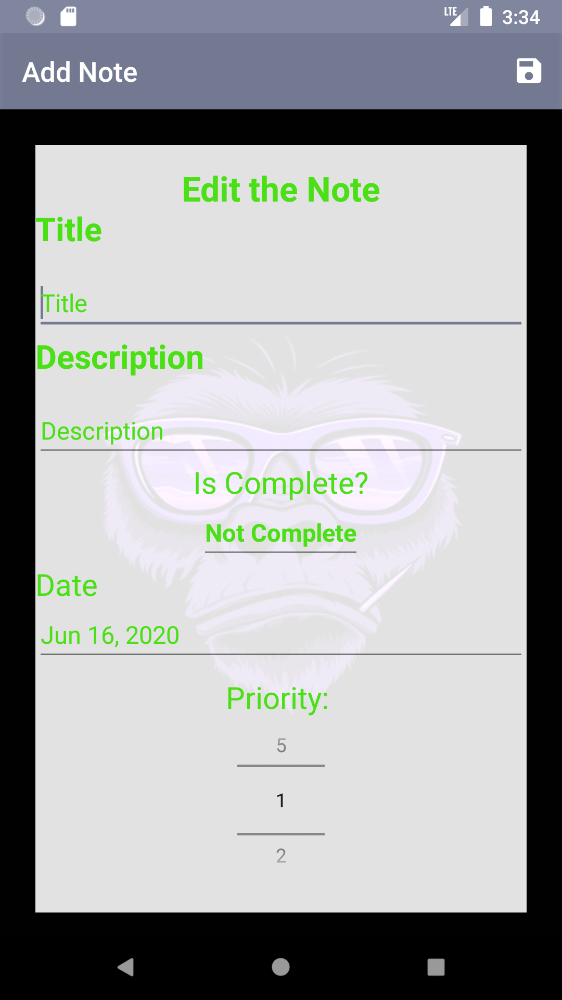
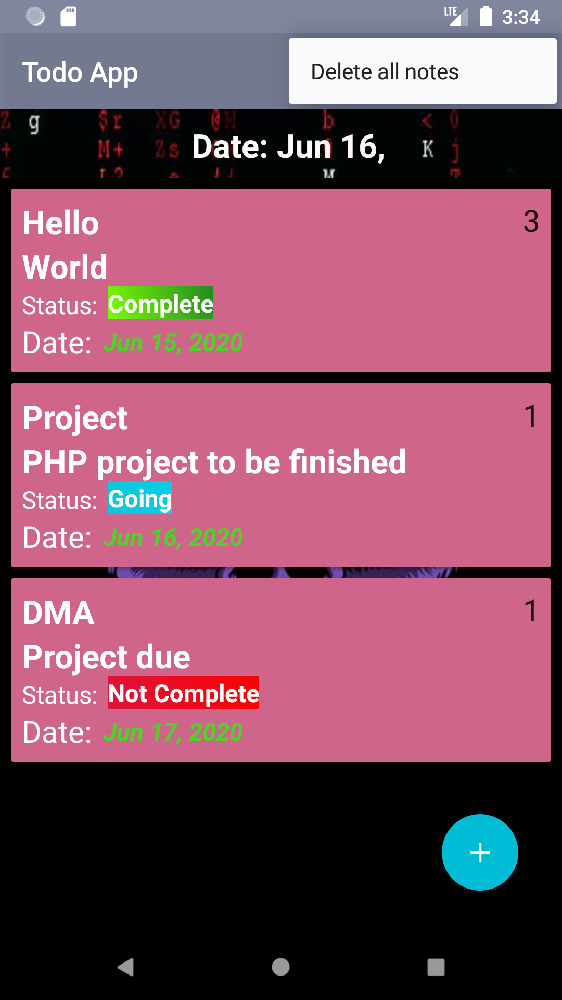

# Features available in the TodoApp
1. Two types of todo app with ORM and without ORM
2. Signin and registration with validations
3. User dashboard for conduction todo activity
4. App information i.e. About and fragments activity for details
5. Crud method in the todo app without orm
6. Add todo list 
7. Edit todo list
8. Delete the todo list
9. MVVM todo without ORM
10. MVVM todo with ORM
11.	Use of recycle views, list view
12.	Use of layouts like linew, coordinator and relative
13.	The todo app is user friendly
14.	Date picker in the app for list
15.	The status of the todo list is classified by background color like green color is for completed and   red is for not completed
16.	Prioty of the todo list can be set from 1 to 5
17.	Date can be set by current date and display of current date
18.	The todo list of orm can be done by swiping any list from left/right or all the list can be deleted   at onces
19.	Different toast message and alert dialog box
20.	Logout fearture of user

